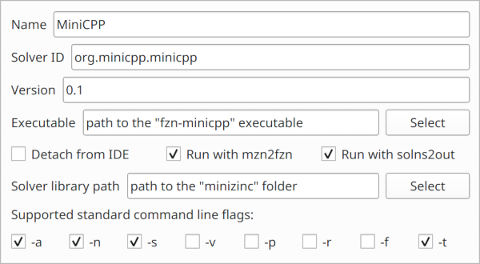

# fzn-minicpp

A C++ constraint solver based on [MiniCP][minicp], compatible with [MiniZinc][minizinc].


## Build

To compile *fzn-minicpp* is necessary to have:

 - GCC (>= 7)
 - CUDA (>= 9)
 - CMake (>= 3.5)

You can compile *fzn-minicpp* using CMake as follows:

```
mkdir build
cd build
cmake .. -DCMAKE_BUILD_TYPE=Release
make
```

## Installation 

You can add *fzn-minicpp* to the MiniZinc IDE as follows:

1. From the toolbar: MiniZinc > Preferences > Solver > Add new...

2. Configure as illustrated:

   


[minicp]: https://doi.org/10.1007/s12532-020-00190-7 "MiniCP: A lightweight solver for constraint programming"
[minizinc]: https://www.minizinc.org
